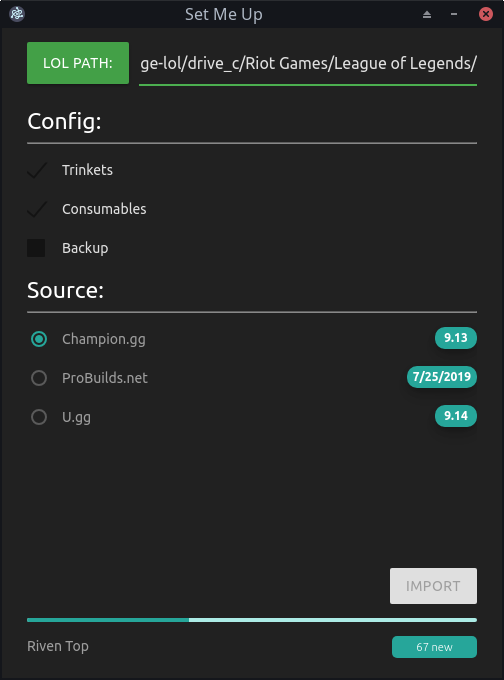
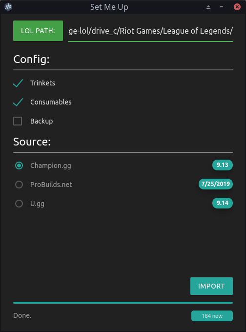

# Set Me Up

## Description

`Set Me Up` is simple yet powerful tool inspired by [Championify](https://github.com/dustinblackman/Championify) to fetch and parse data from some the popular League of Legends statistics websites and convert them to in-game item sets. `Set Me Up` operates using simple HTTP requests to get the data from the websites and then parses their HTML content in order to extract data.

Fetching | Done
:-:|:-:
|

## Supported platforms

So far Windows 10 and Arch Linux (yes you heard right, Linux) have been tested and confirmed to work. Due to the software being written in a cross-platform framework it is presumed that it can be built and ran on OSX as well.

## Download

[Here](https://github.com/7aske/setmeup/releases) - Windows x64 build binary

NOTE: in order for the Linux version to run properly you must run:

```
sudo chown root:root ./chrome-sandbox
```
```
sudo chmod 4755 ./chrome-sandbox
```

## Contribute

People are always welcome to approach with new ideas and improvements. Welcoming all suggestions with item build source websites. Code improvements and pull requests are most welcome as well.

## Build from source

### Requirements

Program was developed using versions `11.15.0` of `node` and version `6.10.1` of `npm`. It will most likely work on some of the earlier versions but it is always recommended to use those specified.

### Setup

Run `npm` install command in the root of the repository. That will install all of the `node` dependencies needed to run the program.

```
$ npm install
```
After installation running the gui is being done by running:

```
$ npm run electron
```
After confirming that everything works you can build packages using two npm scripts:

```
$ npm run build-windows
```

```
$ npm run build-linux
```

NOTE: in order for the Linux version of electron to run properly you must run these as root:

```
# chown root:root ./build/setmeup-linux-x64/chrome-sandbox
```
```
# chmod 4755 ./build/setmeup-linux-x64/chrome-sandbox
```

`npm` build script does this by default.